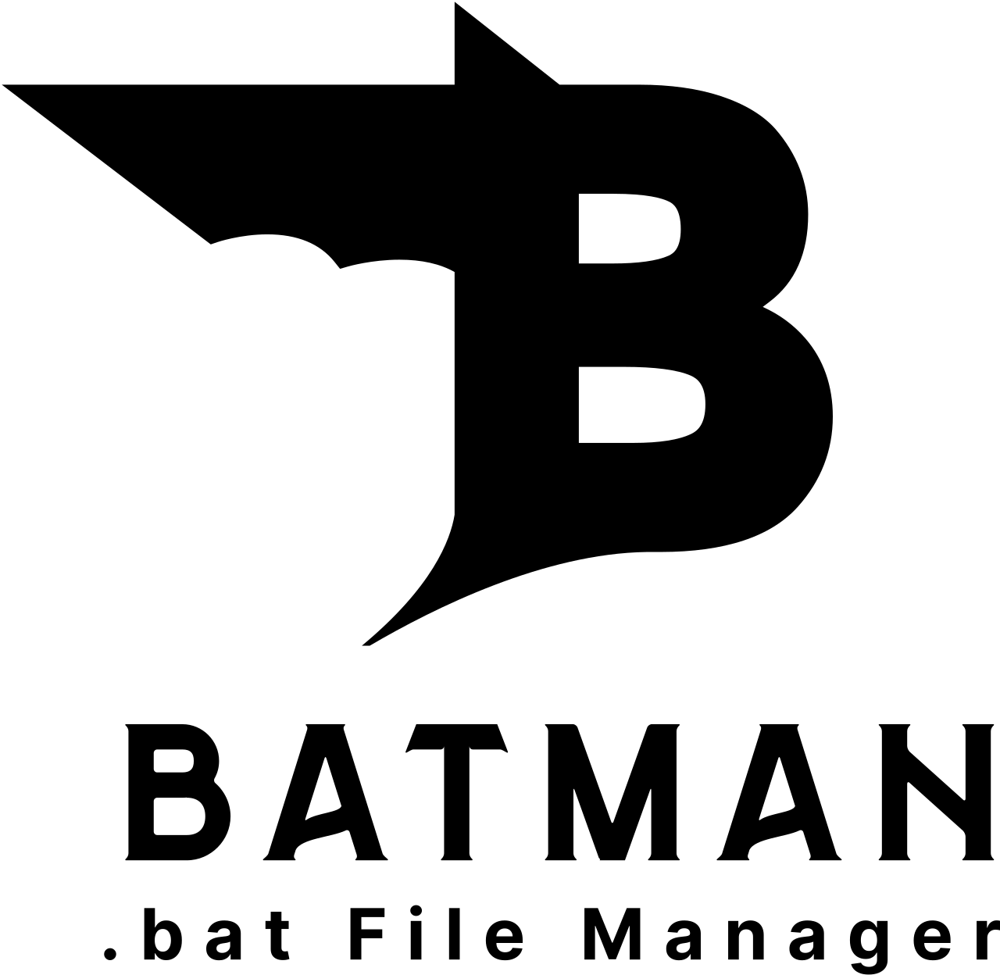

# Batman - Batch Manager 🦇

[English](#english) | [한국어](#korean) | [日本語](#japanese)



---

<a id="english"></a>
## English

### Overview
Batman is a Windows-only batch file manager that allows you to easily manage, run, and monitor your batch files. With a clean and intuitive interface, you can add your favorite batch files, run them individually or all at once, and see their running status in real-time.

### Features
- **Simple Management**: Add, remove, and organize your batch files
- **One-Click Execution**: Run batch files with a single click
- **Status Monitoring**: See which batch files are running (green) or stopped (red)
- **Run All**: Execute all batch files at once
- **Persistent Storage**: Your batch file list is saved between sessions

### Installation
1. **Option 1: Using pre-built release (Recommended)**
   - Download the latest release from [GitHub Releases](https://github.com/your-username/batman/releases)
   - Extract the zip file to your preferred location
   - Run `batman.exe` to start the application
   - If you see a "Windows protected your PC" warning or "Unverified Publisher" message, click on "More info" and then "Run anyway" to proceed

2. **Option 2: Building from source**
   - Make sure you have Flutter installed on your system
   - Clone this repository
   - Install dependencies:
     ```
     flutter pub get
     ```
   - Run the application:
     ```
     flutter run -d windows
     ```

### Usage
1. Click the "+" button in the app bar to add batch files
2. The batch files will appear in the list with their status indicator
3. Click the play button to run a batch file or the stop button to terminate it
4. Use the floating action button to run all batch files at once

### Technology Stack
- Flutter (Windows)
- Dart
- process_run
- file_picker
- shared_preferences
- window_size

### Development
To run tests:
```
flutter test
```

### License
This project is licensed under the MIT License - see the [LICENSE](LICENSE) file for details.

[Back to top ↑](#batman---batch-manager-)

---

<a id="korean"></a>
## 한국어

### 개요
Batman은 Windows 전용 배치 파일 관리자로, 배치 파일을 쉽게 관리, 실행 및 모니터링할 수 있습니다. 깔끔하고 직관적인 인터페이스를 통해 자주 사용하는 배치 파일을 추가하고, 개별적으로 또는 한 번에 모두 실행하며, 실시간으로 실행 상태를 확인할 수 있습니다.

### 주요 기능
- **간편한 관리**: 배치 파일 추가, 제거 및 정리
- **원클릭 실행**: 한 번의 클릭으로 배치 파일 실행
- **상태 모니터링**: 실행 중인 배치 파일(녹색) 또는 중지된 배치 파일(빨간색) 상태 확인
- **일괄 실행**: 모든 배치 파일 한 번에 실행
- **설정 저장**: 앱을 재시작해도 배치 파일 목록 유지

### 설치 방법
1. **옵션 1: 빌드된 릴리스 사용 (권장)**
   - [GitHub Releases](https://github.com/your-username/batman/releases)에서 최신 릴리스를 다운로드
   - 원하는 위치에 zip 파일 압축 해제
   - `batman.exe`를 실행하여 애플리케이션 시작
   - "Windows가 PC를 보호했습니다" 경고 또는 "확인되지 않은 게시자" 메시지가 표시되면, "추가 정보"를 클릭한 다음 "실행"을 선택하여 계속 진행

2. **옵션 2: 소스에서 빌드**
   - Flutter가 시스템에 설치되어 있는지 확인
   - 이 저장소 복제
   - 의존성 설치:
     ```
     flutter pub get
     ```
   - 애플리케이션 실행:
     ```
     flutter run -d windows
     ```

### 사용 방법
1. 앱 바의 "+" 버튼을 클릭하여 배치 파일 추가
2. 상태 표시기와 함께 목록에 배치 파일 표시
3. 재생 버튼을 클릭하여 배치 파일 실행 또는 중지 버튼으로 종료
4. 플로팅 액션 버튼을 사용하여 모든 배치 파일 한 번에 실행

### 기술 스택
- Flutter (Windows)
- Dart
- process_run
- file_picker
- shared_preferences
- window_size

### 개발
테스트 실행:
```
flutter test
```

### 라이센스
이 프로젝트는 MIT 라이센스에 따라 라이센스가 부여됩니다 - 자세한 내용은 [LICENSE](LICENSE) 파일을 참조하세요.

[맨 위로 ↑](#batman---batch-manager-)

---

<a id="japanese"></a>
## 日本語

### 概要
Batmanは、Windowsのみのバッチファイル管理ツールであり、バッチファイルを簡単に管理、実行、監視することができます。クリーンで直感的なインターフェイスにより、お気に入りのバッチファイルを追加し、個別または一度にすべて実行し、リアルタイムで実行状態を確認できます。

### 主な機能
- **シンプルな管理**: バッチファイルの追加、削除、整理
- **ワンクリック実行**: 一回のクリックでバッチファイルを実行
- **状態監視**: 実行中のバッチファイル（緑）または停止中のバッチファイル（赤）を表示
- **一括実行**: すべてのバッチファイルを一度に実行
- **永続的な保存**: セッション間でバッチファイルリストを保存

### インストール方法
1. **オプション1：ビルド済みリリースを使用（推奨）**
   - [GitHub Releases](https://github.com/your-username/batman/releases)から最新リリースをダウンロード
   - 任意の場所にzipファイルを解凍
   - `batman.exe`を実行してアプリケーションを起動
   - 「Windowsによって PC が保護されました」警告または「確認されていない発行元」メッセージが表示される場合は、「詳細情報」をクリックしてから「実行」を選択して続行してください

2. **オプション2：ソースからビルド**
   - システムにFlutterがインストールされていることを確認
   - このリポジトリをクローン
   - 依存関係をインストール:
     ```
     flutter pub get
     ```
   - アプリケーションを実行:
     ```
     flutter run -d windows
     ```

### 使用方法
1. アプリバーの「+」ボタンをクリックしてバッチファイルを追加
2. バッチファイルが状態インジケーターと共にリストに表示される
3. 再生ボタンをクリックしてバッチファイルを実行するか、停止ボタンを押して終了
4. フローティングアクションボタンを使用してすべてのバッチファイルを一度に実行

### 技術スタック
- Flutter (Windows)
- Dart
- process_run
- file_picker
- shared_preferences
- window_size

### 開発
テストを実行するには:
```
flutter test
```

### ライセンス
このプロジェクトはMITライセンスの下でライセンスされています - 詳細は[LICENSE](LICENSE)ファイルをご覧ください。

[トップに戻る ↑](#batman---batch-manager-)
